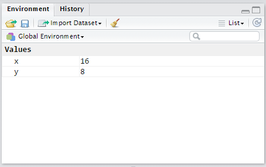

## The R Programming Language

R is an extremely powerful statistical scripting language.  It is open-source and used broadly across academia, research organizations, and businesses.  It is often the tool of choice for data scientists, data analysts, quantitative financial analysts, and a myriad of other professions.  It is used for research at the vast majority of graduate schools.  It is currently used by companies like Facebook, Google, the NY Times and Wallstreet financial organizations.  Microsoft has invested heavily in integrating R into its desktop and cloud data science tools.  Google has written the R Style Guide that is widely used.  Facebook data scientists use R to analyze and understand the vast Facebook social network.


###R or Python?

The world is quickly moving toward leveraging open source data science tools rather than proprietary software.  Over the last 5 years R and Python have risen as the two primary open source tools used by data professionals.  While there is significant overlap in the capabilities of both languages, in general the R Programming language is better at data analysis and visualization, and Python is better at data acquisition and producing code for production environments.  We decided to teach R in this class since it generally has better visualizations, allowing our analysts to tell the data narrative.  Additionally, R is generally more accessible across the Department of Defense.


R is open-source and is freely available to download.  You can use base R as-is to write and run R scripts.  That being said, RStudio has provided a very useful Integrated Development Environment (IDE) or "front-end" for R that is generally easier to use (R is still the "engine"; you can't run RStudio without R).  We will primarily use RStudio in this course.  

Note that you can also run R from a server in the "cloud".  The Army Data Science Center of Education (DSCOE) provides several tutorials that explain how to do this.   


---

##Installation

1. Install Base R by going to [http://cran.r-project.org/bin/windows/base/](http://cran.r-project.org/bin/windows/base/) 
2. Install RStudio by going to [http://www.rstudio.com/products/rstudio/download/](http://www.rstudio.com/products/rstudio/download/)


##R Environment and Workspace

Introductory Video:

<iframe width="800" height="500" src="https://www.youtube.com/embed/46X1-Q0oQMA" frameborder="0" allowfullscreen></iframe>

<!-- [](https://www.youtube.com/watch?v=MGDKfUIgtKk) -->

R is always pointing to a specific directory (or folder) on your computer.  This is called your *working directory*.  R will always directly read files and write files to this directory.  You can see your working directory by typing 


```{r}
getwd()
```


If you want to change where your working directory is, you can do this three ways.  If you are using RStudio, you can go to *Session -> Set Working Directory*.  You can also use the *Files* tab to navigate to your desired working directory, and then click on *More -> Set as Working Directory*.  If you want to change your *working directory* using a command (especially if you're using base R), then you can type

```{r,eval=FALSE}
setwd("C:/Users/beskow/Documents")  ###Make sure you use Forward Slashes in Windows
```

If you want to see the names of files in your working directory without opening Windows Explorer, you can use the command 


```{r}
dir()
```


Note that this gives the names of the files in your working directory, which saves you the time of opening up Windows Explorer to remind yourself what you named your data file.  


Types and Shape of Data
----
Before we get into data, I first want to show you that your command line can operate like a calculator

```{r}
5 + 4 + 7 * 7
```

or

```{r}
pi * 7.2^2
```

Note that in both of these examples, the answer is printed to the screen, but not stored in memory.  In other words, I cannot access that answer without redoing the calculation.  If I want to store it in memory, then I assign the answer to a name. We use the symbol <- to mean "assign".  In other words, the result of the computation on the right of the symbol is assigned to the name on the left of the symbol. For example:

```{r}
x <- 4*4
```

I have now assigned the result of my computation to the name *x*.  If I want to see this value of *x* in the future, I can just type it in the console.

```{r}
x
```

Note that in *RStudio* you can also see your variable in the *Environment* window.  

I can also use it in future computations:

```{r}
y<-x/2
```
*x* is now stored in your *Global Environment*.  Think of this as your "workbench" that contains all of the data and values that you are working on.  In RStudio, you can usually see what is in your *Global Environment* in the top right part of the RStudio window.  



If you're using base R, you can list the variables that are in your *Global Environment* by typing 

```{r}
ls()
```

When you close either RStudio or base R, it will ask you if you want to save your *work space*.  It is essentially asking you if you want to save what is on your workbench.  If you choose "yes", then it will save an *.RData file of everything that is in your workspace in your working directory.  If you restart R from this working directory, it will load all of these items into your workspace.  Generally it is not a good idea to save your workspace as long as you have all of the code it would take to quickly recreate all of the items in your workspace.  However, if you have some code that takes along time to run, then it is best to save these items in a workspace so that you don't have to wait hours/days a second time to recreate them.  For example, I created some R code to "clean" operational combat data.  It took approximately 11 days to clean the data.  In this case, I would want to save my results so I don't have to wait 11 days again for this to run.  In general, however, R takes seconds to run, and it is best to not save your workspace as long as you have clean and easy to run code.

##Data Types

Now that we have R and RStudio installed, let's look at different classes of data.  The basic building blocks are *integer*, *numeric*, *character*, *date*, *boolean* (logical) or *factor* classes of data.  The first four should be self explanatory, and examples of all four are below:

```{r}
x<-4                   #integer
x<-4.56                #numeric
x<-TRUE                #boolean
x<-"Rangers Lead the Way!"  #character
```

Use the class command to find out what type of data you have. Note that because we were using *x* for all three, that we were writing over the value of x.  At the end of running these four lines of code, *x* would equal the last line of code: the character string "Rangers Lead the Way!"

```{r}
class(x)
```

R does not automatically recognize *date* data.  When you read *date* data into R, it is initially converted to *character* data.  If you want R to recognize it as a *date*, you need to explicity change it (we will go over this in more detail later):

```{r}
x<-"2014-01-01"
x<-as.Date(x)
class(x)
```

There is also a type of data called *factor* data.  This is categorical data (often a character string) that has a numeric value tied to it for certain types of models.  Character data is often coerced to the *factor* class when you have nominal data (for example, a *gender* field that contained the strings "male" and "female"). If I change this into a factor, it will still be represented as "male" and "female", but it will also be represented numerically (as a 1 and 2).  You need to be very careful when using factors, since many of the functions in R can't handle factor data.  You can see the use of factor data below:

```{r}
y<-c("male","male","female","male","female")
```
This is character data.  If I tried to plot y right now, R would show an error, since you can't print *character* data.  Lets convert this to a factor now:

```{r}
y<-as.factor(y)
y
```
Now watch when I try to plot this:
```{r}
plot(y)
```

It plots a barchart because R recognizes this as a factor and has a numeric value associated with both of the "levels" in the factor

##Data Structures

The data that we showed above is trivial (and very small) data.  To work with data, we'd prefer to have it organized into a usable data structure.  In this section we will introduce you to the four primary data structures that we will use: 

Data Structure | Definition
-------------|  -----------------
Vector | Data in one dimension
Data Frame | Two dimensional data (most commonly used data structure)
List | A one dimensional data structure that can contain any class of data (objects could be other data structures)
Matrix | Multi-dimensional data of the same class


There are also different dimensions of data.  So far we've been using *scalars*, in which our variable x is a single value.  Data can have 1, 2, or many dimensions, however.  

###Vector Data Structure

One dimensional data that is of the same class is often organized into a *vector*.  All objects in a vector must be of the same class (or will be coerced to the same class).  A picture of a vector is given below


An example of a vector in R is given below:

```{r}
x<-c(1,6,3,9,8,2)    ## "c" means combine the values into a vector
```


If you need to create a vector of sequential integers, you can use a colon:

```{r}
x<-c(1:10)
x
```

If you need to create a vector of the same number, you can use the repeat command:

```{r}
rep(1,10)  # Repeat 1 ten times
```

###Data Frame Data Structure

Anyone who has used Microsoft Excel is used to seeing data in the traditional two dimensional table.  The data frame structures data in this way.  A picture of a data frame is provided below:


Each column of a data frame is a vector, and must have the same class of data.  A data frame is a list of vectors where each each vector has the same length.  A data frame is usually created when you read data from an external file (usually a CSV file), but you can create one manually, as seen below:

```{r}
##Create a data frame
apft <- data.frame(Name = c("John","Laura","Jim"),
                   Gender = c("M","F","M"),
                   PU = c(70, 52, 49),
                   SU = c(90, 85, 60),
                   Run = c("14:28","13:30","12:36"))

##Print object
apft

```


###List Data Structure

A list is a linear container for objects of any class or data structure.  Each object in list is separate and distinct.  

A list is helpful in several situations.  For example, there are many time you have vectors that do not all have the same length.  For example, lets say we extracted hash-tags from Tweets at the Rio Olympics.  The number of hash-tags per tweet can range from zero to seven or eight (see Figure 6 below).  You can't store these vectors in a data frame because they aren't the same length.  A list is the appropriate object to store these vectors in.


A list is also helpful for storing different types of data in a single object.  For example, we can store a scalar, a data frame, and a vector in a single list:

```{r}
##Store a scalar, vector, and data frame in a list
myList <- list(y, x, apft)

##Print object
myList
```

Lists also create a great container for reading multiple data files into R and combining them into a single data frame.  We will teach this technique later.

###Matrix Data Structure

While an important data structure in R, we will not use the matrix structure often in this course.  A matrix is a multi-dimensional array of numeric, boolean, or integer data (NOT character, date, or factor data).  


Below is an example of creating a matrix object in R:

```{r}
## Example of setting row and column names
mdat <- matrix(c(1,2,3, 11,12,13), nrow = 2, ncol = 3, byrow = TRUE)

##Print object
mdat

```

As mentioned above, we will not use matrices much in this course.


##Input/Output Data

Now that we have all of that done, let's learn how to read and write data.  To do this with some fun data, let's read in some data on movie ratings.  This data contains users that rated movies in 2015. Each record (or row) represents a single user rating a single movie.  Movies can have more than one rating, and users can rate more than one movie. Make sure you download the data at [https://s3.amazonaws.com/dscoe-data/rating2.csv](	https://s3.amazonaws.com/dscoe-data/rating2.csv) and follow along with this tutorial.  

Note: if you're using a cloud environment, you can download the data by running the following command:

```{r, eval = FALSE}
download.file("https://s3.amazonaws.com/dscoe-data/rating2.csv", destfile = "rating2.csv")

```

We use the command *read.csv* to read in data.  We also make sure to assign this to an object name (in this case, the object name is ``rating``)

```{r}
rating <- read.csv("rating2.csv", as.is = TRUE)
```

The ``as.is = TRUE`` parameter ensures that any character data is formatted into a *character* vector rather than a *factor* vector.  As a personal preference, I always explicitly convert to the *factor* data type when necessary so that I don't have any undesired consequences.

Now that we've read the file in, we'll explore this data object a little bit.  Below is the top commands that I use to explore a data object.  

One of the most powerful commands to explore any object is the structure command ``str``.  This command gives the overall size of the object (in this case it has 283,886 rows and 7 columns), as well as the class of each column vector and the first few observations from each column vector.  

```{r}
##The structure command prints the structure of the data object
str(rating)
```

Related to the ``str`` command is the ``summary`` command.  This command is especially helpful if you have numeric data in the object and you want to view some of the basic statistics regarding this data.

```{r}
##The summary command prints summary statistics about an object in memory
summary(rating)
```

I usually also use the command ``head`` to print the first 5 rows.  This gives titles of the variables (columns) as well as a feel for the data:

```{r}
##The head command prints the first five rows of the data set
head(rating)
```

If you only want to print the names of the columns, use the ``names`` command:

```{r}
##The names command just prints the column names of a data frame
names(rating)
```

Finally, if we only want the dimensions of the data, we can use ``dim`` to get all of the dimensions, ``*nrow`` to access the number of rows, and ``ncol`` to access the number of columns:

```{r}
##The dim command prints the dimensions of the object
dim(rating)

##The nrow command prints the number of rows of a data frame
nrow(rating)

##The ncol command prints the number of columns of a data frame
ncol(rating)
```

##Getting Help

There's several ways to get help in R.  The ``help`` function and the ``?`` function can access the documentation for packages and functions that you have loaded into R.  ``help.search`` and the ``??`` function both search within documentation for loaded packages.  Additionally, you can use the ``args`` function to print out the arguments for a function.

```{r}
##Getting help for the str function
help(str)

##or
?str

##Searching within documentation for "subset"
help.search('subset')

##or
??subset

```


##Practice Problem

Download the Korean War Casualty Data by downloading the Comma Separated Value (CSV) file here: 

[https://s3.amazonaws.com/dscoe-data/KoreanConflict.csv](https://s3.amazonaws.com/dscoe-data/KoreanConflict.csv)

If you're using a cloud environment, you can download the data by running the following command:

```{r, eval = FALSE}
download.file("https://s3.amazonaws.com/dscoe-data/KoreanConflict.csv", destfile = "KoreanConflict.csv")

```

Read this into your R environment.  Explore the data given the commands that we leaned this lessons.  We will use this data in future lessons.  
