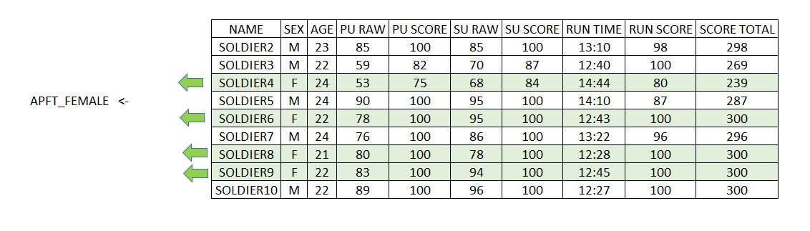
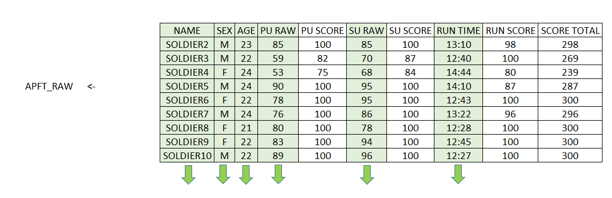

# Basic Data Manipulation

The most time intensive task in data science endeavors is pre-processing data.  Real world data is often complex and messy.  Data processing (sometimes called "munging" or "data wrangling") cleans and manipulates data so that it is in a form that is useful for models and visualizations.  The R programming language is one of the best tools for manipulating data.  This lesson will discuss the basics of data structure as well as ways to subset, extract and otherwise manipulate basic data.


##Data

For this lesson we will use casualty data from the Korean War. This data is available at [Kaggle](https://www.kaggle.com/datasets).  You should have downloaded this data for the practice problem in Lesson 1.  First, let's read the data into R:

```{r}
kor <- read.csv("KoreanConflict.csv", as.is = TRUE)
```

Now let's explore the data with some of the tools we learned in Lesson 1.  First, let's look at the structure of the data:

```{r}
str(kor)  ## Print the structure of the Korean Casualty Data
```

We see that this data has 36,574 rows and 25 columns.   It appears that each row of the data represents an individual service member who died in the Korean War.  Note that every single column is a *character* vector. This includes the rows like ``BIRTH_YEAR`` and ``INCIDENT_DATE`` that appear like they should be numeric (the fact that they are character means that at least one entry in this column has *alphabetic letters* rather than *numbers*).


##Cell level data access


This data set contains two dimensions (rows and columns).  To access specific rows and columns in R, we use _[row,column]_ format.  For example, to access the data in the first row and first column of Korea data, we would use

```{r}
kor[1,1]  ##First row, first column

```

If we want to access the first 5 entries from the first column, we would use

```{r}
kor[1:5,1] ##First five entries from the first column

```

Now if we want to access the first three rows from the 1st, 3rd, and 8th column, we use the following format

```{r}
kor[1:3,c(1,3,8)]

```

You can also use column names (or headers) to extract data from specific columns. This is especially helpful if you can't remember respective column numbers, or if you think the column order will ever change. To extract the first three rows of data from ``BRANCH``, ``RANK``, and ``HOME_STATE``, we can use the code below.

```{r}
kor[1:3,c("RANK","BRANCH","HOME_STATE")]

```


Remember that each column represents a vector.  In addition to the method we just showed, you can access data from each column vector with the following script:

```{r}
kor$RANK[1:5]  ##Prints first five entries in RANK vector

```

The script above essentially says select the RANK column from the ``kor`` data frame, and then print to the screen the first five entries of this column. 

## ``Table`` Command (and an example of data "cleaning")

Let's explore the data a bit more.  The ``table`` command provides a great way to see all of the possible entries in categorical data.  The table command has similar functionality to *Pivot Tables* in Excel, but is much easier to use.  To illustrate this command, we will table the ``BIRTH_YEAR``

```{r}
table(kor$BIRTH_YEAR) ##Table BIRTH_YEAR

```

The table command provides the number of records for each category.  Here we learn that our data is a bit messy.  Notice that although most of the entries are numerical, that there are numerous entries that don't look like a year.  We can see this again if we table data by gender:

```{r}
table(kor$SEX)  ##Table by gender

```

Note that this doesn't give just *male* and *female*.  For our purposes we're going to try to remove this *messy* data.  Note that in some cases you will want to fix messy data, not remove it.  In removing the data, I am going to assume that the same rows of data that produce errors in the GENDER field are the same rows of data that will produce errors in the ``BIRTH_YEAR`` data.  To remove this data, we will leverage the fact that we want to keep all of the data from ``BIRTH_YEAR`` that is numeric, and get rid of every *row* of data that contains alphabetical *character* data.  In the following code we will coerce this column into numeric data.


```{r}
kor$BIRTH_YEAR <- as.numeric(kor$BIRTH_YEAR)

```

The ``as.numeric`` command coerces the data to the numeric class.  Note that there is also an ``as.character`` and ``as.factor`` command that will coerce data to these respective data classes.  This ``as.numeric`` command will create an NA value for every entry that is not numeric.  It is now much easier to remove all rows that contain an NA in the ``BIRTH_YEAR`` column.  The code below provides a way to subset the data by removing the rows that contain an NA value in the ``BIRTH_YEAR`` column.  There are many ways to subset and cut data in R.  Below we will use the bracket functionality that we discussed above.  You can also use the ``subset`` command in the base R packages.  Later in this tutorial we will use the ``filter`` command that comes in the ``dplyr`` package.  

```{r}
 kor <- kor[!is.na(kor$BIRTH_YEAR),]   ##Remove rows that contain an NA value in the BIRTH_YEAR column

```

In the code above, the ``is.na`` function produces a Boolean vector with TRUE values if an NA value is found.  The exclamation point means NOT, and changes every TRUE to a FALSE (meaning it now produces a TRUE value if there is NOT an NA in that cell).  By feeding this into our bracket functionality, we subset the data by removing all rows that contain an NA in the BIRTH_YEAR column.  Now lets check the dimensions of our data:

```{r}
dim(kor)

```

We now have 33,899 rows of data, meaning that we lost 2,675 rows of data.  If we were conducting an in-depth study of the Korean War Casualties, we couldn't just delete this data, but would rather have to painstakingly clean it.  For our purposes, we are just going to delete it.  

Now let's see if that cleaned up the GENDER field.  To do that, let's call on the ``table`` command again:

```{r}
table(kor$SEX)

```

Notice that the data is now clean, and that in our cleaned data we only have two female casualties recorded.  Let's now use the table command to explore the data a bit more.  Let's create a table by rank:

```{r}
table(kor$RANK)

```

From this we learn that the PFC rank sustained the highest casualty numbers, and that the highest ranking casualty was a General (assuming this means 4-star General).  Now let's explore NATIONALITY.  We assume that this is all US Nationality, but when we run this table command

```{r}
table(kor$NATIONALITY)

```

we find out that there are a few other nationalities represented in the data.  It's interesting when we table the MARITAL_STATUS field that 

```{r}
table(kor$MARITAL_STATUS)

```

we find out that the marital status of most of the casualties was unknown (which makes you wonder about the Defense Department data collection during the Korean War).  Now let's move on to filtering (or extracting a subset) of our data.


##Filter (or subset) data

Extracting a subset of data is one of the most fundamental tasks of data manipulation.  There a many different ways to filter data in R.  In addition to using the *bracket* functionality discussed above, you could use the ``subset`` command provided in Base R.  Today, one of the foremost R Programming Developers (Hadley Wickam) has developed a special packages called ``dplyr`` [[@R-dplyr] and ``tidyr`` [@R-tidyr] just for data wrangling.  For the sake of simplicity, we will attempt to primarily use these packages for data wrangling in this course.  


  

Given a two dimensional data structure, we can think of several ways we might want to extract data.  The first is to extract rows associated with a certain feature.  For example, if we had some basic data from an Army Physical Fitness (APFT) test, we may want to extract rows based on GENDER, as seen below. 




If we were going to conduct this same operation (extract all FEMALE records) on our ``kor`` data frame with the ``dplyr`` package, we would execute the following command:

```{r,warning=FALSE,message=FALSE}
library(dplyr)
kor_female <- dplyr::filter(kor, SEX=="F")
```

This command should produce a new data frame in your environment that has has two rows and 25 columns.  This new data frame only contains the two FEMALE casualties represented in the data.  To explore this much smaller data set, we could now table the data frame based on state:

```{r}
table(kor_female$HOME_STATE)

```

and find out that one woman is from Iowa, and the other from West Virginia.  If we table based on rank:

```{r}
table(kor_female$RANK)

```

we find out that both women were junior officers.  If you take a look at the data further, you will learn that both women were in the Air Force and died in a non-hostile accident in 1952 on the same day (presumably the same accident).  

Note that we can also filter rows based on a Boolean function.  For example, if we wanted to only look at casualties that were over 30 years old in 1950, we could filter with the following ``dplyr`` command:

```{r}
kor_Over30 <- filter(kor, BIRTH_YEAR < 1920)  ##Filter those older than 30 in 1950

```

When you run this command, you will find that our cleaned data produces 2220 records of casualties that were over 30 in the year 1950.  If we wanted to only select those individuals that were in their 30's in 1950, we would use the following ``dplyr`` command:

```{r}
kor_30s <- filter(kor, BIRTH_YEAR < 1920 & BIRTH_YEAR > 1910)

```

Running this command we find that 1,991 of the casualties were in their 30's in 1950.  

Now that we've filtered by row, let's show how to filter by column.  We've already demonstrated above how to do this with the bracket notation, now we will illustrate how to do this using the ``dplyr`` package. We often find that we've loaded data that has many columns that we're not interested in.  In these cases, it is often helpful to extract the columns that we're interested in.  This will also shrink the size of our data in memory, and make our code run faster. In the picture below, we illustrate this with some simple APFT data (in this case we're extracting the demographic and raw score columns):




Let's say we were studying the Korean Casualty data to understand the time factor of those who died of wounds, and were particularly interested in the time between ``INCIDENT_DATE`` and ``FATALITY_DATE``.  Below we'll extract these two columns with the ``dplyr`` package:

```{r}
kor_dates <- select(kor, one_of(c("INCIDENT_DATE","FATALITY_DATE"))) #Select two columns

```

Now if we look at the structure of this new data frame:

```{r}
str(kor_dates)

```

We see that we only have two columns, but still have all 33,899 rows.  The code below is beyond the extent of this lesson on filtering (it contains some code we'll go over in Lesson 5) but is interesting to look at the difference between incident date and fatality date.  In this code we will load the ``lubridate`` package [@R-lubridate] (another package written by Hadley Wickam) and use it to convert these two columns to date format and calculate the difference between them (i.e. the number of days between the incident that the death of the Service Member).  

```{r,message=FALSE, warning=FALSE}
library(lubridate)
days <- ymd(kor_dates$FATALITY_DATE) - ymd(kor_dates$INCIDENT_DATE)
days[1:100]
```

Looking at the first few entries makes us wonder.  The very first entry had 18,253 days between the incident and the fatality.  In fact, if you look closer at the dates, you will see that this Service Member had an incident on 12 April 1951, but wasn't considered a fatality until 2 April 2001.  In fact, if we quickly plot a histogram of the difference in days (you'll learn this command next lesson):


```{r}
#plot histogram of difference in days
hist(as.numeric(days), main="Histogram of Difference in Days", xlab="Days")  

```

Here we see that there's a number of casualties that seem to have a fatality day around the year 2000.  If you look at the original data will see that the first Service Member in the data (an Air Force Captain) is listed with an incident year of 1951 and ``FATALITY_DATE`` in 2001.  Notice that the FATALITY status is _DECLARED DEAD_.  This officer, as part of a bombing group, must have had an MIA status for several decades until finally "declared dead" in 2001.  The "declared dead" date became his fatality date, which means it would be difficult to evaluate the temporal aspect of wound care with this data. 

##Using the grep and aggregate commands

The following video illustrates how to use the grep and aggregate commands.  This video will use movie rating data that you downloaded in Lesson 1.  

```{r, eval = FALSE}
download.file("https://s3.amazonaws.com/dscoe-data/rating2.csv", destfile = "rating2.csv")

```

<iframe width="800" height="500" src="https://www.youtube.com/embed/05VPIKAh9tE" frameborder="0" allowfullscreen></iframe>


##Summary

What we have seen is that R produces a great platform to rapidly "wrangle" and explore data.  

##Practice Problem
1. Use grep to determine how many casualties had *INFANTRY somewhere in their title (use the ``POSITION`` field).
